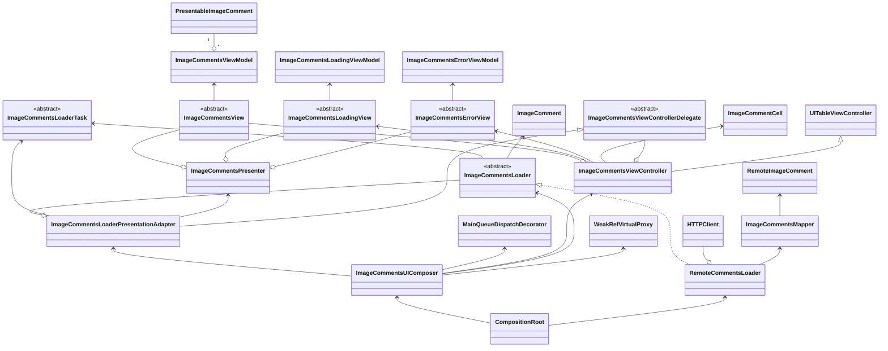

```mermaid
classDiagram

class ImageCommentsLoaderTask { <<abstract>> }
class ImageCommentsLoader { <<abstract>> }
class ImageCommentsView { <<abstract>> }
class ImageCommentsLoadingView { <<abstract>> }
class ImageCommentsErrorView { <<abstract>> }
class ImageCommentsViewControllerDelegate { <<abstract>> }

ImageCommentsView --o ImageCommentsViewController
ImageCommentsLoadingView <-- ImageCommentsViewController
ImageCommentsErrorView <-- ImageCommentsViewController
ImageCommentCell <-- ImageCommentsViewController
ImageCommentsViewControllerDelegate --o ImageCommentsViewController
UITableViewController <|-- ImageCommentsViewController
ImageCommentsLoaderTask <-- ImageCommentsLoader
ImageComment <-- ImageCommentsLoader
ImageCommentsLoader <|.. RemoteCommentsLoader

PresentableImageComment "1" --o "*" ImageCommentsViewModel
ImageCommentsViewModel <-- ImageCommentsView
ImageCommentsLoadingViewModel <-- ImageCommentsLoadingView
ImageCommentsErrorViewModel <-- ImageCommentsErrorView

ImageCommentsView --o ImageCommentsPresenter
ImageCommentsLoadingView --o ImageCommentsPresenter
ImageCommentsErrorView --o ImageCommentsPresenter

ImageCommentsLoader --o ImageCommentsLoaderPresentationAdapter
ImageCommentsLoaderTask <-- ImageCommentsLoaderPresentationAdapter
ImageCommentsPresenter <-- ImageCommentsLoaderPresentationAdapter
ImageCommentsViewControllerDelegate <|-- ImageCommentsLoaderPresentationAdapter
ImageCommentsLoaderPresentationAdapter <-- ImageCommentsUIComposer
MainQueueDispatchDecorator <-- ImageCommentsUIComposer
ImageCommentsViewController <-- ImageCommentsUIComposer
ImageCommentsLoader <-- ImageCommentsUIComposer
WeakRefVirtualProxy <-- ImageCommentsUIComposer
ImageCommentsUIComposer <-- CompositionRoot
RemoteCommentsLoader <-- CompositionRoot
HTTPClient --o RemoteCommentsLoader
ImageCommentsMapper <-- RemoteCommentsLoader
RemoteImageComment <-- ImageCommentsMapper
```

